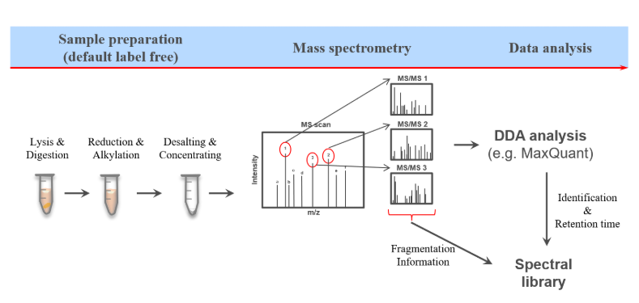

# Library Generation for DIA Analysis

## **Questions:**

  - How does the peptide identification work in data independent acquisition (DIA) mass spectrometry (MS) data?
    
-   What is a spectral library and how to generate a spectral library using Maxquant, diapysef and OpenSwath tools?
    

# **Objectives:**

   - Generating a spectral library from data dependent acquisition (DDA) MS data
    
-   Understanding DIA data principles and characteristics
    
-   Optimizing and refining a spectral library for the analysis of DIA data

# **Bioinformatics tools used:**

MaxQuant, PTXQC,  diapysef, OpenSwathAssayGenerator, OpenSwathDecoyGenerator, TargetedFileConverter

# Background

For complex protein mixtures, bottom-up mass spectrometry is the standard approach. In bottom-up proteomics, proteins are digested with a specific protease into peptides and the measured peptides are in silico reassembled into the corresponding proteins. To enable the identification and quantification of such high numbers of proteins in a time-wise limited measurement there has been a lot of MS method and data acquisition optimization.

**Data dependent analysis** **(DDA)** as its name calls is highly dependent on the abundance of the respective peptides at a given retention time. This dependency on both time as well as intensity leads to measurement specific identifications between multiple measurements.

Another more recently developed methodology the so-called **data independent acquisition (DIA)**. However due to some unique characteristics of this acquisition method it requires spectral libraries, which contain the peptide sequences as well as their respective fragment spectrum (MS2) information.

One of the most popular proteomics software is **MaxQuant**. MaxQuant is a widely used search engine for bottom-up proteomics because it is easy to use and a free software that offers functionalities for nearly all kinds of proteomics data analysis challenges . Mass spectrometry raw data is normally obtained in a vendor specific, proprietary file format. MaxQuant can directly take those raw files as input. For peptide identification MaxQuant uses a search engine called “**Andromeda**”.

_**diapysef**_ is a library generator: the filtered MaxQuant results (unique peptides only) are combined with iRT standards to create a library for DIA. This step creates the **bridge**: turning DDA discovery results into a usable DIA spectral library.



# Agenda

 - Get data 
 - MaxQuant Analysis of DDA 
 -data Quality control results 
 -Filter for unique peptides in the evidence and msms output 
 - diapysef library generation 
 - Spectral library refinement with **OpenSwathAssayGenerator**
  
 - Adding decoy sequences with **OpenSwathDecoyGenerator**     
 - Converting the spectral library with **TargetedFileConverter** Conclusion

# Get data

Create a new history in galaxy project and import the fasta and raw files as well as the experimental annotation and the iRTassays file from [Zenodo](https://zenodo.org/record/4293493)

```
https://zenodo.org/record/4293493/files/Human_database_plus_iRT.fasta
https://zenodo.org/record/4293493/files/Ecoli_database.fasta
https://zenodo.org/record/4293493/files/iRTassays.tsv
https://zenodo.org/record/4293493/files/HEK_Ecoli_exp_design.txt
https://zenodo.org/record/4293493/files/Sample1.raw
https://zenodo.org/record/4293493/files/Sample2.raw
https://zenodo.org/record/4293493/files/Sample3.raw
https://zenodo.org/record/4293493/files/Sample4.raw
https://zenodo.org/record/4293493/files/Sample5.raw
```


Once the files are green, generate a collection for all .raw files (and name it DDA_data) as well as for both .fasta files (and name it FASTA)

# **MaxQuant**  Analysis of DDA data

1.  **MaxQuant**  (  Galaxy version 2.0.3.0+galaxy0)  with the following parameters:
    -   In  _“Input Options”_:
        -   param-collection  _“FASTA files”_:  `FASTA`  collection
        -   _“identifier parse rule”_:  `>([^ ]*)`
        -   _“description parse rule”_:  `^>.*\|.*\|[^ ]+ (.*) OS.*$`
        - 
***comment/note***: 

*The reference protein sequences (HEK + E.coli FASTA files). MaxQuant uses these to identify peptides/proteins from the MS/MS data.*
*Identifier parse rule: `>([^ ]*)`:The regex tells MaxQuant how to extract the _protein identifier_ from FASTA headers (everything right after `>` until the first space)*
*Description parse rule: `^>.*\|.*\|[^ ]+ (.*) OS.*$`***  :
*This regex extracts the _protein description_ from the FASTA header (the protein name part).**

   In  _“Search Options”_:
        -   param-file  _“Specify an experimental design template”_:  `HEK_Ecoli_exp_design.txt`(=***my notes:** This text file tells MaxQuant which raw file corresponds to which condition/replicate/sample. Essential for downstream quantification and grouping*).
        -   _“minimum unique peptides”_:  `1`
        -   _“Match between runs”_:  `Yes`(***=my notes:** this Allows MaxQuant to transfer peptide identifications between runs by aligning retention times → increases coverage, especially important for DIA library building.*)
    -   In  _“Protein quantification”_:
        -   _“Use only unmodified peptides”_:  `No`
    -   In  _“Parameter Group”_:
        -   param-collection  _“Infiles”_:  `DDA_data`  collection
            -   _“missed cleavages”_:  `1`(=***my notes:**-*Allows up to 1 missed cleavage site for trypsin digestion. Example: if trypsin should cut at K/R but doesn’t)* MaxQuant still considers that peptide valid.*)
            -   _“variable modifications”_:  `Oxidation (M)`(*=**my notes**: Methionine oxidation is included as a variable modification. Common and biologically relevant,  allowing too many variable mods -> increases search space*.)
    -   _“Generate PTXQC (proteomics quality control pipeline) report? (experimental setting)”_:  `True` (=***my notes**: PTXQC is a QC (quality control) tool for proteomics. This will generate a report checking data quality (e.g. peptide length distributions, digestion efficiency, labeling efficiency, etc.).*
    -   In  _“Output Options”_:
        -   _“Select the desired outputs.”_:  `Protein Groups`  `Peptides`  `mqpar.xml`  `Evidence`  `MSMS`;
        
        **In summary:**  
I am telling MaxQuant to search your DDA data against the FASTA (HEK + E. coli), using standard digestion/modification settings, with MBR enabled to maximize coverage. I'll get out protein- and peptide-level tables, plus QC reports and evidence-level details from PTXQC— all of which will later be used for the **DIA library generation** step.

   
 
  
        
       **comments**:  
       1. Proteins that share all their peptides with other proteins cannot be unambiguously identified. Therefore, MaxQuant groups such proteins into one protein group and only one common quantification will be calculated. The different protein properties are separated by semicolon. 
       4.   Approximately 5,370 proteins were found (from ProteinGroups output)
       5. Approximately 34,970 peptides were found (from Peptides output)


# **Filter** for unique peptides in the _evidence_ and _msms_ output

Filtering the  **MaxQuant**  search results for unique peptides[]

1.  **Filter**  with the following parameters: -  param-file  _“Infile”_:  `MaxQuant_Evidence` (*=**my notes**: Evidence file from MaxQuant. This contains all peptide-spectrum matches (PSMs), including both unique and shared peptides.)*
    -   _“With following condition”_:  `len(c9.split(';')) < 2`*(**my notes=** refers to **column 9** = Protein IDs that the peptide could map to;
 "keep only rows where the peptide is assigned to" fewer than 2 proteins → i.e. peptides that map to exactly one protein (unique peptides)**.)*
    -   _“Number of header lines to skip”_:  `1`
2.  **Rename**  galaxy-pencil  the output file to ‘Filter on MaxQuant_Evidence’
    
    > Tip: Renaming a dataset[](https://training.galaxyproject.org/training-material/topics/proteomics/tutorials/DIA_lib_OSW/tutorial.html#tip-renaming-a-dataset-1)
    
3.  **Filter**  with the following parameters: -  param-file  _“Infile”_:  `MaxQuant_MSMS`*(=**my notes**: the MSMS.txt file contains detailed information about MS/MS spectra and their assigned peptides.)*
    -   _“With following condition”_:  `len(c12.split(';')) < 2`*(=**my notes** : Same logic: peptides mapping to more than one protein get multiple IDs separated by `;`.)*
    -   _“Number of header lines to skip”_:  `1`
4.  **Rename**  galaxy-pencil  the output file to ‘Filter on MaxQuant_MSMS’


**comment** 
1. To avoid ambigious protein mapping later, we filter the **MaxQuant** search results for unique peptides only. Shared peptides would confuse quantification because they cannot be assigned to a single protein confidently.
2.  ~103,000 lines in the evidence and ~98,000 lines in the msms.

# *diapysef* library generation

***diapysef*** is a library generator: the filtered MaxQuant results (unique peptides only) are combined with iRT standards to create a library for DIA. This step creates the **bridge**: turning DDA discovery results into a usable DIA spectral library.

1.  ****diapysef library generation**  generates spectral library for DIA analysis**  (  Galaxy version 0.3.5.0):
    -   In  _“MaxQuant output file msms.txt_:
        -   param-file  _“Infile”_:  `Filter on MaxQuant_MSMS`*(=**my notes**: we give diapysef the filtered MSMS table.  contains spectral details: which fragment ions were observed for each peptide. it's  what goes into the DIA library.)*
    -   In  _“MaxQuant output file evidence.txt_:
        -   param-file  _“Infile”_:  `Filter on MaxQuant_Evidence`(=my notes: Contains quantitative features: retention time, precursor m/z, intensities.  needed to anchor spectral info to peptide features.) 
    -   In  _“Retention time alignment method”_:
        -   param-file  _“Infile”_:  `iRTassays.tsv` *(=**my notes:** synthetic peptides with known retention behavior that span the LC gradient. diapysef uses them to **normalize RTs across runs** (e.g., convert observed RT into a normalized scale).*
    


**notes** : 
-to allow for improved alignment, synthetic (non-endogenous) peptides were spiked-in to all samples prior to the MS measurement. 
-First the measured retention times (RTs) of those spiked-in peptides are extracted in the **MaxQuant** search results. Using the measured RTs as well as arbitrary assigned values (ranging from -26 to 99) a linear regression through the 11 synthetic peptides is applied. 
-Based on this linear regression fit _indexed_ retention times (iRTs) are assigned to all other peptides.
-8 iRT peptides were found in the first DDA file and 9, 8, 10, 10 in the consecutive 4 DDA files.

***summary***

 - parsed the MSMS + Evidence files**, keeping only **unique peptide IDs**.
 - extracted **precursor–fragment transitions** (m/z, charge, intensity) from MSMS.
  - aligned RTs using the **iRT peptides** (in iRTassays.tsv).
   - Output: a **spectral library** in tabular format (TSV) or specific formats (like `.pqp` later) → used by DIA tools like **OpenSWATH**.

# Spectral library refinement with  **OpenSwathAssayGenerator**

This step makes the spectral library “DIA-ready” by filtering and optimizing the peptide transitions

Spectral library optimization and refinement using  **OpenSwathAssayGenerator**
1.  **OpenSwathAssayGenerator**  (  Galaxy version 2.6+galaxy0)  with the following parameters:
    -   _“Output file type – default: determined from file extension or content”_:  `tabular (tsv)`
    -   _“MZ threshold in Thomson for precursor ion selection”_:  `0.015`*(=my notes: Defines the **mass tolerance** (in Thomson = Da) for precursor selection. A peptide precursor m/z must be within ±0.015 Da of the theoretical m/z to be accepted.)*
    -   _“upper MZ limit for precursor ions”_:  `1000.0`*(=my notes: Only precursors with **m/z ≤ 1000 Da** will be included. Higher m/z precursors (usually multiply charged big peptides) are excluded because: They fragment less reproducibly,  harder to detect in DIA windows.)*
    -   _“MZ threshold in Thomson for fragment ion annotation”_:  `0.015`*(=**my notes**: same as above but for fragment ions)*


**notes** : 

- The spectral library coming from **diapysef library generation** contains all observed fragment ions from the DDA runs resulting in a relativly large spectral library. 
- Large libraries can lead to increased processing times as well as fewer identifications after adjusting based on the False Discovery Rate (FDR). Thus, it is recommened to optimize and refine the spectral library by e.g. filtering for peptides with at least 6 transitions (increased confidence) and limiting the maximum also to 6 transitions (avoiding inflated libraries).
- Furthermore, the scan range can be adjusted (here between 400 - 1000 m/z) covering the same m/z range as in the DIA measurements.
- The refined library contains ~178,900 lines around 700,000 lines were removed.

# Adding decoy sequences with  **OpenSwathDecoyGenerator**

Adding  _decoy_  transitions to the spectral library

1.  **OpenSwathDecoyGenerator**  (  Galaxy version 2.6+galaxy0)  with the following parameters:
    -   _“Output file type – default: determined from file extension or content”_:  `tabular (tsv)`
    -   _“Advanced Options”_:  `Show Advanced Options`
        -   _“MZ threshold in Thomson for fragment ion annotation”_:  `0.015`*(=**my notes:** sets the tolerance (±0.015 Da) when assigning/validating fragment ions for the **decoy transitions**).*
        


**notes/remarks** : 

--   In DIA analysis, every peptide detection has to be judged: **is it real, or just noise that matches by chance?**
    
-   To measure this, OpenSWATH uses a **target–decoy strategy**:
    
    -   **Target transitions** = the real peptide–fragment transitions.
        
    -   **Decoy transitions** = “fake” peptides, generated by shuffling or modifying real ones, that _should not_ exist in the sample.
        
-   By searching both target and decoy assays in the DIA data:
    
    -   If many decoys are scored as “hits,” the cutoff is too loose.
        
    -   If few/no decoys are scored, cutoff is stricter.
        
-   This enables calculation of the **false discovery rate (FDR)** → how many of the peptide identifications are likely false.
- This step is about **quality control**. The decoys are “fake peptides” that act like negative controls. They let you measure error rates and keep only confident identifications in DIA analysis.

# Converting the spectral library with  **TargetedFileConverter**

Converting the final spectral library from  _.tsv_  to the sqlite  _.pqp_  format

(*=**my notes**: This step is just like converting a giant messy spreadsheet (`.tsv`) into a neat, indexed **database file (`.pqp`)**, which DIA software can load much faster and more reliably.)*

1.  **TargetedFileConverter**  (  Galaxy version 2.6+galaxy0)  with the following parameters:
    -   _“Output file type – default: determined from file extension or content”_:  `pqp`*(=**my notes** : A utility from the **OpenMS** toolkit. Converts spectral librarie between different formats (TSV, TraML, PQP, etc.).*

(**=my remarks from this steps :** 

-   **TSV** is human-readable, but:
    
    -   Very large for big libraries (hundreds of thousands of peptides).
        
    -   Slower to load and parse.
        
-   **PQP (SQLite database):**
    
    -   Compressed, indexed, and optimized for querying during DIA analysis.
        
    -   Stores all peptide/fragment/RT/intensity information in structured tables.
        
    -   Ensures reproducibility — the PQP schema is standardized across OpenSWATH workflows.)

# Conclusion - future steps
Built a  **spectral library for DIA** starting from DDA data: running MaxQuant, filtering for unique peptides, generating the initial library with diapysef, refining it with OpenSWATH tools, adding decoys for FDR estimation, and finally converting to the efficient `.pqp` format.

Ensures DIA analysis will be both **comprehensive and statistically robust**. The next steps are to apply this library in **OpenSWATH ** to analyze DIA runs, validate identifications (FDR control), and proceed to **biological interpretation and quantitative comparisons** between samples.


